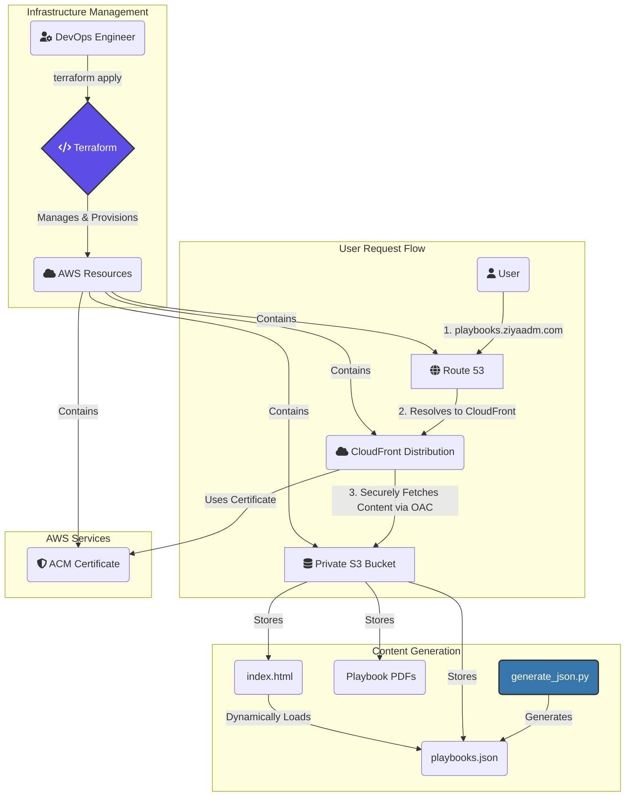

# AWS Serverless Static Site for Support Playbooks

A professional portfolio project demonstrating a secure, scalable, and fully automated serverless architecture for hosting a static website on AWS. This project serves as a practical showcase of modern cloud infrastructure and DevOps best practices using Infrastructure as Code.

[](https://opensource.org/licenses/MIT)

## 🚀 Live Demo

**The live, production-ready site is available here:**

### 👉 [https://playbooks.ziyaadm.com](https://playbooks.ziyaadm.com)

---

## ✨ Key Features & Technical Highlights

This project goes beyond simple hosting and implements a production-grade setup:

*   **Infrastructure as Code (IaC):** The entire AWS infrastructure is defined declaratively using **Terraform**, enabling automated, repeatable, and version-controlled deployments.
*   **Secure, Private Storage:** All site content (HTML, PDFs, JSON) is stored in a **private S3 bucket**. Direct public access is blocked, adhering to the principle of least privilege.
*   **Global Content Delivery Network (CDN):** An **AWS CloudFront** distribution serves all content, providing low-latency delivery to users worldwide and protecting against common web threats.
*   **Secure Origin Access:** CloudFront uses **Origin Access Control (OAC)** to securely access content from the S3 bucket, ensuring the bucket remains private and is only accessible by the CDN.
*   **Automated DNS & TLS:** **AWS Route 53** manages the custom domain, and **AWS Certificate Manager (ACM)** provides and automatically renews the SSL/TLS certificate for secure HTTPS traffic.
*   **Server-Side Encryption:** All data at rest in the S3 bucket is encrypted using **SSE-S3**.
*   **Dynamic Content Loading:** The `index.html` page dynamically fetches a `playbooks.json` file, which is generated by a Python script. This allows the list of playbooks to be updated without changing the HTML, separating data from presentation.

## 🏛️ Architecture Diagram

The following diagram illustrates the flow of a user request and the underlying AWS services managed by Terraform.



## 🛠️ Technology Stack

*   **Cloud Provider:** AWS
*   **Infrastructure as Code:** Terraform
*   **Core AWS Services:**
    *   Amazon S3
    *   Amazon CloudFront
    *   Amazon Route 53
    *   AWS Certificate Manager (ACM)
*   **Frontend:** HTML5, CSS3 (Bootstrap), JavaScript
*   **Tooling:** Python 3 (for content generation)

## ⚙️ Local Setup and Deployment

> **Prerequisites:**
> *   [Terraform](https://learn.hashicorp.com/tutorials/terraform/install-cli) installed.
> *   [AWS CLI](https://docs.aws.amazon.com/cli/latest/userguide/getting-started-install.html) installed and configured with appropriate credentials.

1.  **Clone the repository:**
    ```sh
    git clone <repository-url>
    cd aws-playbooks-site/infra
    ```

2.  **Initialize Terraform:**
    This downloads the necessary providers and sets up the backend.
    ```sh
    terraform init
    ```

3.  **Plan the deployment:**
    This shows you what resources will be created.
    ```sh
    terraform plan
    ```

4.  **Apply the infrastructure:**
    This will provision all the AWS resources.
    ```sh
    terraform apply
    ```

### Updating Content

After the initial deployment, content can be managed manually or via a CI/CD pipeline.

1.  **Generate the playbooks JSON:**
    ```sh
    # Run from the 'infra' directory
    python3 generate_json.py
    ```

2.  **Upload files to S3:**
    Use the AWS CLI to sync your content directories to the S3 bucket.
    ```sh
    # Example: Uploading the playbooks
    aws s3 sync ./playbooks s3://aws-playbooks-ziyaadm/playbooks/

    # Example: Uploading the main page and JSON file
    aws s3 cp ./index.html s3://aws-playbooks-ziyaadm/index.html
    aws s3 cp ./playbooks.json s3://aws-playbooks-ziyaadm/playbooks.json
    ```

3.  **Invalidate the CloudFront Cache:**
    To ensure users see the latest version, you must invalidate the CloudFront cache.
    ```sh
    # Replace YOUR_DISTRIBUTION_ID with your actual CloudFront Distribution ID
    aws cloudfront create-invalidation --distribution-id YOUR_DISTRIBUTION_ID --paths "/*"
    ```

## 🚀 Future Improvements

This project provides a solid foundation. Future enhancements could include:

*   **CI/CD Pipeline:** Implement a GitHub Actions workflow to automatically run `generate_json.py`, sync content to S3, and create a CloudFront invalidation on every push to the `main` branch.
*   **Search Functionality:** Add a client-side search feature to filter the playbooks directly on the webpage.
*   **Logging and Monitoring:** Implement CloudWatch dashboards to monitor site traffic, error rates, and performance.

## 📄 License

This project is licensed under the MIT License. See the [LICENSE](LICENSE) file for details.

---

Built by Ziyaad Motala as a personal project to showcase AWS and DevOps skills.