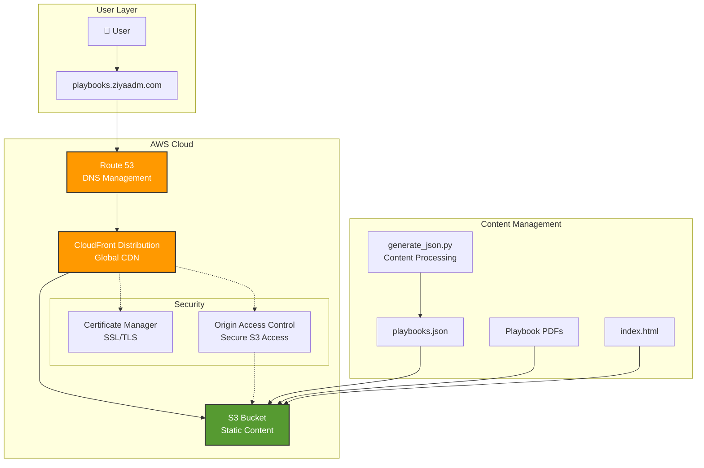

# AWS Playbooks Site

A professional, serverless static website showcasing AWS support playbooks with a modern, responsive interface. Built with Infrastructure as Code (Terraform) and deployed on AWS using best practices for security, scalability, and performance.

[](https://opensource.org/licenses/MIT)
[](https://aws.amazon.com)
[](https://terraform.io)

## 🚀 Live Demo

**Production Site:** [https://playbooks.ziyaadm.com](https://playbooks.ziyaadm.com)

## ✨ Features

### Frontend
- **Modern UI/UX** - Clean, professional design with dark/light theme toggle
- **Responsive Design** - Optimized for desktop, tablet, and mobile devices
- **Advanced Search & Filtering** - Filter by category, severity, and status
- **Dynamic Content Loading** - Real-time search and sorting capabilities
- **Accessibility** - WCAG compliant with keyboard navigation support

### Backend & Infrastructure
- **Infrastructure as Code** - Complete AWS infrastructure managed with Terraform
- **Serverless Architecture** - No servers to maintain, fully managed services
- **Global CDN** - CloudFront distribution for low-latency worldwide access
- **Security First** - Private S3 bucket with Origin Access Control (OAC)
- **SSL/TLS** - Automatic certificate management with AWS Certificate Manager
- **Custom Domain** - Route 53 DNS management with alias records

## 🏗️ Architecture



## 🛠️ Technology Stack

### Infrastructure
- **Cloud Provider:** AWS
- **IaC Tool:** Terraform
- **CDN:** Amazon CloudFront
- **Storage:** Amazon S3
- **DNS:** Amazon Route 53
- **SSL/TLS:** AWS Certificate Manager

### Frontend
- **Languages:** HTML5, CSS3, JavaScript (ES6+)
- **Frameworks:** Tailwind CSS (CDN)
- **Features:** Responsive design, dark mode, search/filter

### Backend
- **Language:** Python 3
- **Libraries:** Standard library (os, json, re, datetime, collections)
- **Purpose:** Dynamic content generation and processing

## 📁 Project Structure

```
aws-playbooks-site/
├── infra/
│   ├── main.tf              # Core AWS infrastructure
│   ├── variables.tf         # Input variables
│   ├── outputs.tf           # Output values
│   ├── terraform.tfvars     # Variable values
│   ├── generate_json.py     # Content processing script
│   ├── index.html           # Main website file
│   ├── playbooks.json       # Generated playbook data
│   └── playbooks/           # PDF playbook files
├── README.md                # This file
└── .gitignore              # Git ignore rules
```

## 🚀 Getting Started

### Prerequisites
- [Terraform](https://terraform.io/downloads) >= 1.3.0
- [AWS CLI](https://aws.amazon.com/cli/) configured with appropriate credentials
- Python 3.x
- A registered domain name in Route 53

### Deployment Steps

1. **Clone the repository:**
   ```bash
   git clone <repository-url>
   cd aws-playbooks-site/infra
   ```

2. **Configure variables:**
   ```bash
   # Edit terraform.tfvars with your values
   cp terraform.tfvars.example terraform.tfvars
   ```

3. **Initialize Terraform:**
   ```bash
   terraform init
   ```

4. **Plan deployment:**
   ```bash
   terraform plan
   ```

5. **Deploy infrastructure:**
   ```bash
   terraform apply
   ```

6. **Generate content:**
   ```bash
   python3 generate_json.py
   ```

7. **Upload content:**
   ```bash
   # Sync all content to S3
   aws s3 sync . s3://your-bucket-name --delete \
     --exclude "*.tf*" --exclude "*.py" --exclude ".terraform*"
   ```

8. **Invalidate CloudFront cache:**
   ```bash
   aws cloudfront create-invalidation \
     --distribution-id YOUR_DISTRIBUTION_ID \
     --paths "/*"
   ```

## 🔧 Configuration

### Environment Variables
Key configuration is handled through `terraform.tfvars`:

```hcl
# terraform.tfvars
project_name = "aws-playbooks"
owner_name   = "your-name"
region       = "us-east-1"
domain_name  = "yourdomain.com"
subdomain    = "playbooks"
```

### Content Management
The `generate_json.py` script processes PDF files and creates structured JSON data:

- **Automatic categorization** based on filename and content
- **Severity classification** (High, Medium, Low)
- **Tag extraction** for enhanced searchability
- **Draft status detection** for workflow management

## 🔒 Security Features

- **Private S3 Bucket** - No public access, secured with bucket policies
- **Origin Access Control** - CloudFront-only access to S3 content
- **HTTPS Enforcement** - All traffic encrypted with TLS 1.2+
- **Security Headers** - Implemented via CloudFront
- **IAM Least Privilege** - Minimal required permissions

## 📈 Performance Optimizations

- **Global CDN** - CloudFront edge locations worldwide
- **Optimized Caching** - Managed cache policies for static content
- **Gzip Compression** - Automatic compression for text files
- **Modern Web Standards** - HTTP/2 support
- **Efficient JavaScript** - Optimized search and filtering algorithms

## 🧪 Testing

The project includes automated validation:

```bash
# Validate Terraform configuration
terraform validate

# Check Python script functionality
python3 generate_json.py

# Test website locally
python3 -m http.server 8000
```

## 🔄 CI/CD Ready

The project structure supports easy integration with CI/CD pipelines:

- **GitHub Actions** workflows can be added for automated deployment
- **AWS CodePipeline** integration possible
- **Terraform Cloud** compatible

## 📝 Contributing

1. Fork the repository
2. Create a feature branch
3. Make your changes
4. Test thoroughly
5. Submit a pull request

## 🐛 Troubleshooting

### Common Issues

**Certificate validation fails:**
- Ensure domain is properly configured in Route 53
- Check ACM certificate status in us-east-1 region

**S3 sync errors:**
- Verify AWS CLI credentials and permissions
- Check bucket policy and CORS configuration

**CloudFront cache issues:**
- Create invalidation for updated content
- Check distribution status before testing

## 📊 Cost Optimization

This architecture is designed for cost efficiency:
- **S3 Standard** for frequently accessed content
- **CloudFront** pay-per-use model
- **Route 53** minimal DNS query charges
- **ACM** certificates are free for AWS resources

## 🛡️ Monitoring & Logging

Consider implementing:
- **CloudWatch** dashboards for performance metrics
- **AWS X-Ray** for request tracing
- **CloudTrail** for API activity logging
- **GuardDuty** for security monitoring

## 📄 License

This project is licensed under the MIT License - see the [LICENSE](LICENSE) file for details.

## 🤝 Support

For questions or support:
- Create an issue in this repository
- Contact: [Your Email]
- LinkedIn: [Your Profile]

---

**Built by Ziyaad Motala** - Showcasing AWS cloud architecture and DevOps expertise

*This project demonstrates practical knowledge of AWS services, Infrastructure as Code, and modern web development practices suitable for cloud engineering roles.*